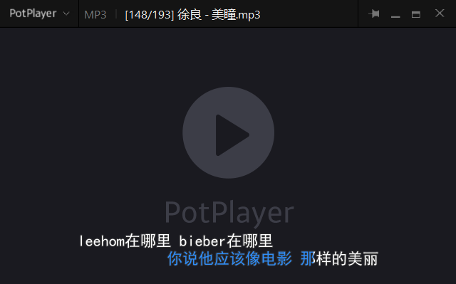

# subtitle_svr

歌词字幕搜索与 ASS / LRC 生成服务。按文件名（或目录监听）自动从kg下载
KRC 歌词，解密后转换为卡拉 OK 风格的 ASS 字幕，同时支持 LRC / eLRC / JSON 导出。
增加 potplayer 字幕插件，支持播放自动下载字幕并显示。

## 功能特性

- **HTTP 服务**：提供搜索 / 下载 / 删除接口，供播放器（如 PotPlayer）调用。
- **多来源生成**：支持从kg歌词（KRC）与本地 CUE 文件生成字幕。
- **KRC 解密与转换**：内置 KRC 解密、KRC→ASS、KRC→LRC 工具。
- **目录监听（可选）**：配置监听目录后，文件新增/移动时自动生成字幕；
  不配置目录则不开监听，服务仅提供查询接口。
- **SQLite 索引**：已生成字幕按关键词建索引，重复查询直接命中缓存。
- **跨平台路径映射**：Windows（Samba UNC）与 Linux（本地挂载）路径互转。

## PotPlayer效果演示



## 目录结构

```
subtitles_svr/
├── config.yaml            # 配置（端口 / 路径 / 接口 / ASS 样式等集中于此）
├── requirements.txt
├── main.py                # 入口（python main.py）
├── subtitles_svr/         # 服务包
│   ├── config.py          # 配置加载（dataclass + YAML）
│   ├── server.py          # HTTP 服务入口
│   ├── subtitle_data_mgr.py  # 搜索/下载/删除 编排 + SQLite 索引
│   ├── subtitle_from_kugou.py  # kg歌词来源
│   ├── subtitle_from_cue.py    # CUE 文件来源
│   ├── krc_decrypt.py     # KRC 解密
│   ├── ass_gen.py / lrc_gen.py # ASS / LRC 生成
│   ├── file_watch.py      # 目录监听（watchdog）
│   ├── file_index.py      # SQLite 索引
│   ├── krc2ass.py / krc2lrc.py # 离线批量转换工具
│   └── potplayer_plugin/  # PotPlayer 插件资源
```

## 安装

```bash
pip install -r requirements.txt
```

## 运行

```bash
# 使用 config.yaml（默认端口 8085）
python main.py

# 指定配置 / 覆盖监听地址与端口
python main.py --config /path/to/config.yaml --port 9000
python -m subtitles_svr.server --host 127.0.0.1 --port 9000
```

## 接口

- `GET /search?filename=<路径>&meta_fileExtension=<ext>&max_item=2` 搜索字幕
- `GET /download?id=<id>&format=ass|lrc|elrc|json` 下载 / 转换字幕
- `GET /delete?keys=<a-b-c>&double_check=yes` 删除索引

## 配置说明（config.yaml）

- `server`：监听地址与端口。
- `watch`：**可选功能**。Windows / Linux 监听目录留空即关闭监听；
  - `ignore_suffixes` 忽略临时文件，
  - `poll_timeout` 为轮询间隔（秒）。
- `paths`：索引库目录与跨平台路径前缀映射。
- `subtitle`：默认语言 / 格式 / 最大条数 / CUE 并发数。
- `ass`：ASS 样式（字体、颜色、边距、卡拉 OK 段落节奏等）。
- `kugou`：**敏感信息**。请自行查找接口；
  - `timeout` 为请求超时（秒）。

## 退出

Ctrl+C 或 SIGTERM 优雅退出；监听线程为守护线程，主线程退出即终止进程。
